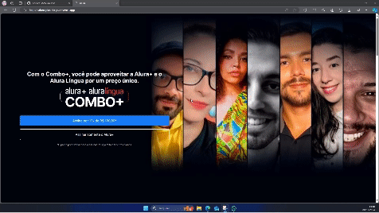
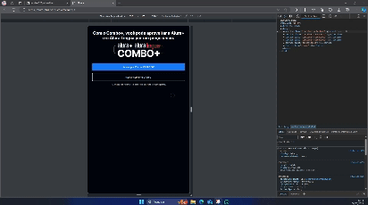

# Alura Plus: Praticando HTML e CSS

Esse pequeno projeto foi feito para praticar e fundamentar conceitos de HMTL e CSS que foram estudados na [Alura](https://www.alura.com.br).  
Caso você esteja curioso, pode conferir o resultado clicando [nesse link](https://alura-plus-six-puce.vercel.app/).
